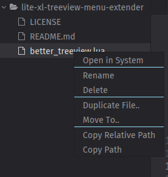

# Lite XL Treeview Menu Extender
Additional file operation menu for Lite XL's treeview.
## Installation
Clone this repo into your plugins folder, or download `better_treeview.lua` file and put it in your plugins folder.
## Additional Menu
This plugin adds this menu to Lite XL :
- `Move To..` : Move a file or directory to another path
- `Duplicate File..` : Duplicate a file to the current directory
- `Copy Path`: Copy absolute file path to clipboard
- `Copy Relative Path`: Copy relative file path to clipboard

## Screenshot

